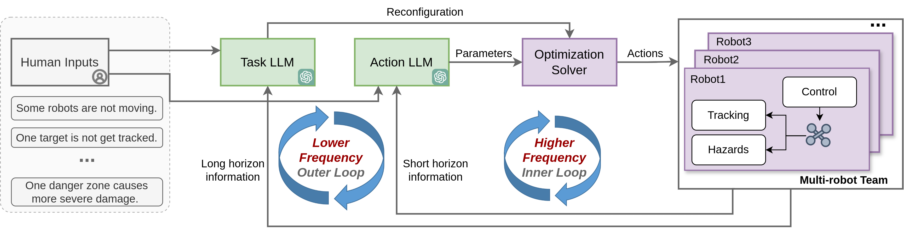

# Hierarchical LLMs In-the-loop Optimization

A hierarchical Large Language Models (LLMs) in-the-loop optimization framework for real-time multi-robot task allocation and target tracking in an unknown hazardous environment subject to sensing and communication attacks.


## About 

__Authors__: [Yuwei Wu](https://github.com/yuwei-wu), [Yuezhan Tao](https://sites.google.com/view/yuezhantao/home), [Peihan Li](https://scholar.google.com/citations?user=Qg7-Gr0AAAAJ&hl=en), [Guangyao Shi](https://guangyaoshi.github.io/), Gaurav S. Sukhatmem, and Vijay Kumar, and [Lifeng Zhou](https://zhourobotics.github.io/)

__Video Links__:  [Youtube]()


__System Architecture__: 

<p align="center">
  
</p>


### Prerequisites

- [ROS](https://wiki.ros.org/ROS/Installation): Our framework has been tested in ROS Noetic.

- [Forces Pro](https://www.embotech.com/products/forcespro/overview/): You can request an academic license from [here](https://www.embotech.com/products/forcespro/licensing/).

- [openai](https://platform.openai.com/docs/overview): Install by 

```
pip install openai
```


### Run 

```
python tracker_server.py exp1
```

change exp to test different settings.

- You may need to clean the solver folder when you change some setups from problem and dangerzone.


### Config

- LLM related paramters. Set true to run LLMs. The duration is to control the calling frequency. (will change to callback later)

```
llm_inner_dur: 2
llm_outer_dur: 10
llm_on: True
```

- Use steps and dt to control the experiment duation.
```
steps: 100
Problem: dt: 0.2
```

- Use task ability to change the maximum number of target a robot can track
```
task_ability: 1
```